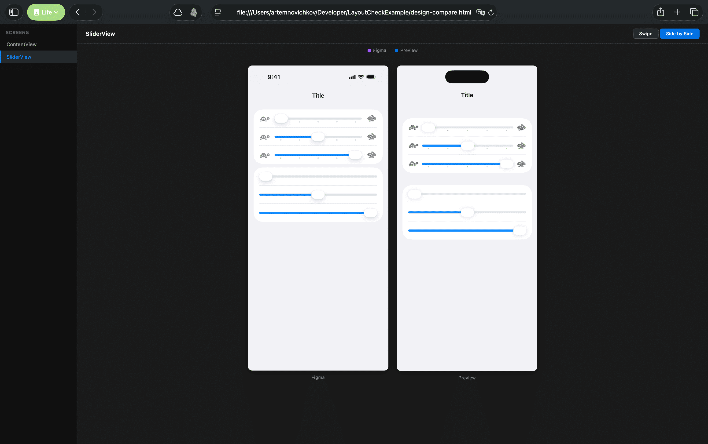

# Skills

A collection of agent skills for iOS and Swift development workflows — crash triage, design comparison, build notifications, and log analysis.

## Available Skills

### [design-compare](skills/design-compare)

Compare Figma designs against implementation screenshots with interactive HTML comparison reports.



- Exports Figma nodes at 3x scale via API
- Analyzes layout, typography, colors, components, sizing
- Generates structured match/mismatch reports
- Interactive HTML with swipe slider and side-by-side views
- Multi-screen support in a single report

### [crashlytics](skills/crashlytics)

Generate crash reports from Firebase Crashlytics with automated fix proposals and developer assignments.

- Fetches fatal errors from Firebase Crashlytics
- Analyzes stack traces and identifies root causes
- Proposes specific fixes with code snippets
- Assigns crashes to developers via git blame
- Calculates severity scores (0-100)

### [oslog](skills/oslog)

Read, stream, and analyze Apple unified logs (OSLog) for iOS/macOS apps.

- Auto-detects subsystem from `Logger(subsystem:)` in source code
- Shows recent logs from the live system log store
- Streams logs in real time from a running app
- Analyzes `.logarchive` bundles with full predicate filtering

### [xcodebuild-notify](skills/xcodebuild-notify)

macOS notifications for `xcodebuild` commands, mimicking Xcode's build notifications.


- Sends a notification after every `xcodebuild` build
- Shows `Build Succeeded` or `Build Failed` as title
- Body format: `<scheme> | <project> Project`

## Installation

### Any Agent (via [skills.sh](https://skills.sh))

```bash
npx skills add artemnovichkov/skills
```

To install a single skill:

```bash
npx skills add artemnovichkov/skills --skill design-compare
```

### Claude Code

```bash
/plugin marketplace add artemnovichkov/skills
```

## Author

Artem Novichkov, https://artemnovichkov.com/

## License

The project is available under the MIT license. See the [LICENSE](./LICENSE) file for more info.
