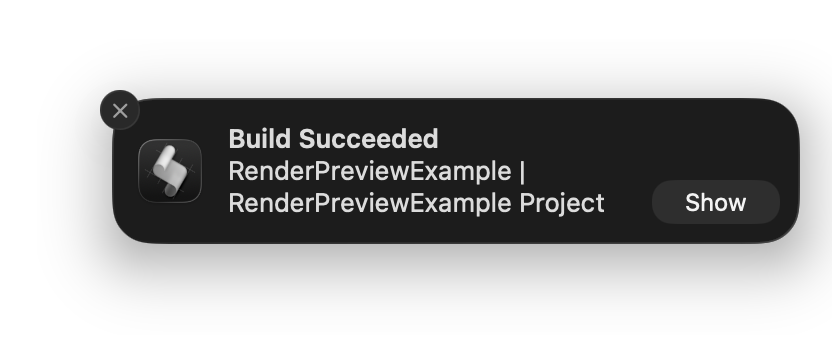

# Claude Code Skills

Collection of Claude Code skills for enhanced development workflows.

## Available Skills

### Crashlytics
Generate crash reports from Firebase Crashlytics with automated fix proposals and developer assignments.

**Features:**
- Fetches fatal errors from Firebase Crashlytics
- Analyzes stack traces and identifies root causes
- Proposes specific fixes with code snippets
- Assigns crashes to developers via git blame
- Calculates severity scores (0-100)
- Groups related crashes
- Generates comprehensive markdown reports

**Category:** Development
**Version:** 1.0.0

### xcodebuild-notify
macOS notifications for `xcodebuild` commands, mimicking Xcode's build notifications.



**Features:**
- Sends a notification after every `xcodebuild` build
- Shows `Build Succeeded` or `Build Failed` as title
- Body format: `<scheme> | <project> Project`

**Category:** Development
**Version:** 1.0.0

## Structure

```
.
├── .claude-plugin/
│   └── marketplace.json       # Marketplace config
└── skills/
    ├── crashlytics/          # Crashlytics skill
    │   ├── .claude-plugin/
    │   │   └── plugin.json
    │   ├── .mcp.json
    │   ├── README.md
    │   └── commands/
    │       └── crash-report.md
    └── xcodebuild-notify/    # xcodebuild-notify skill
        ├── .claude-plugin/
        │   └── plugin.json
        ├── README.md
        └── hooks/
            ├── hooks.json
            └── scripts/
                └── xcodebuild-notify.sh
```

## Installation

```bash
/plugin marketplace add artemnovichkov/skills
```

## Author

Artem Novichkov, https://artemnovichkov.com/

## License

The project is available under the MIT license. See the [LICENSE](./LICENSE) file for more info.
